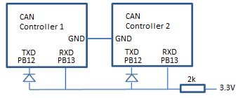

# Controller Area Network (CAN) Interface

The following project tests the FDCAN interface on the STM32H7, however it is not using any of the FDCAN features (just normal CAN).

The transmitter MCU transmits the string "Trillium" on the FDCAN2 peripheral, while the receiver MCU waits for the messages and prints it through USART3 for debugging.

## Hardware Setup
Due to not having a CAN transceiver, this projects uses the diode trick as discussed in application note [AP2921](https://www.mikrocontroller.net/attachment/28831/siemens_AP2921.pdf). The schematic is as follows:

Hardware used:

* Two STM32H7 development boards
* One 2kohm resistor
* Two 1N914 fast diodes
* Wires

## CAN Initialization Settings
The biggest catch to working with the CAN peripheral is configuring its large amount of settings. The important settings for this example are:
* **`hfdcan1.Init.Mode`**: Not doing anything fancy, just set to `FDCAN_MODE_NORMAL`. 
* **`hfdcan1.Init.StdFiltersNbr`**: Defines the number of standard message ID filters that the RX handler will choose to accept. Set to 1 for this example, because we are only transmitting one type of message.
* **`hfdcan1.Init.RxFifo1ElmtsNbr`**: Specifies the number of elements that the RX FIFO1 can hold. Set to 1, because one message is transmitted at a time.
* **`hfdcan1.Init.RxFifo1ElmtsSize`**: Specifies the data size of the message stored in the RX FIFO1.
* **`hfdcan1.Init.TxFifoQueueElmtsNbr`**: Specifies the number of TX buffers used for the FIFO. To use the FIFO capability, this setting must be set to at least 1 according to page 2451 of the [reference manual](https://www.st.com/content/ccc/resource/technical/document/reference_manual/group0/c9/a3/76/fa/55/46/45/fa/DM00314099/files/DM00314099.pdf/jcr:content/translations/en.DM00314099.pdf#page=2451).
* **`hfdcan1.Init.TxFifoQueueMode`**: Specifies if the FIFO or the queue will be used for TX transactions. This example uses the FIFO, so this setting is set to `FDCAN_TX_FIFO_OPERATION`.
* **`hfdcan1.Init.TxElmtSize`**: Specifies the data size of the messages to transmit.

## TX Header Configuration
Prior to transmitting the first message, a TX Header must be initialized and configured. This header is passed to any of the transmit functions and defines the format in which the data will be sent. Each message type will require its own TX Header, with a unique identifier. This allows the receiver to filter for only the message types that it is interested in. It is important that these settings match what was defined in the peripheral intialization:
* **`TxHeader.DataLength`**: The amount of bytes that will be sent in the frame. For classic CAN protocol, this value can only go up to `FDCAN_DLC_BYTES_8`. This value is can be less than or equal to `hfdcan1.Init.TxElmtSize`.
* **`TxHeader.FDFormat`**: This field must match the mode set in `hfdcan1.Init.FrameFormat`. The two options are either `FDCAN_CLASSIC_CAN` or `FDCAN_FD_CAN`.

## RX Filter Configuration
The receiver device will only accept a byte once the CAN identifier has passed the filter phase. Configuration details for a receiver filter are as follows:
* **`sFilterConfig.IdType`**: Using normal CAN, so set to `FDCAN_STANDARD_ID`.
* **`sFilterConfig.FilterIndex`**: Specifies which filter will be initialized. When using `FDCAN_STANDARD_ID`, value must be between 0 and 127.
* **`sFilterConfig.FilterType`**: Specify the type of filter. `FDCAN_FILTER_DUAL` is a filter than can accept two identifiers. Although not using two filters in this case, other options were strange so this one works.
* **`sFilterConfig.FilterConfig`**: Configure which FIFO will store the received byte, `FDCAN_FILTER_TO_RXFIFO1` for this case.
* **`sFilterConfig.FilterID1`**: Specifies the filter ID. This should be the same as `TxHeader.Identifier`.
