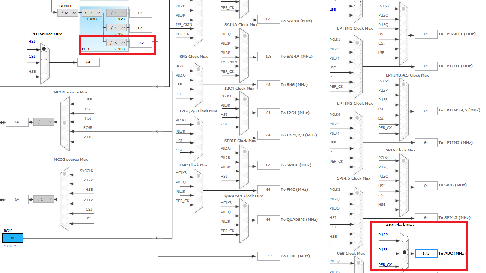

# Internal Temperature Sensor
The following project tests out the internal temperature sensor in the STM32H743 MCU. 

## Configuration
The sensor is connected to channel 18 of [ADC3](https://www.st.com/content/ccc/resource/technical/document/reference_manual/group0/c9/a3/76/fa/55/46/45/fa/DM00314099/files/DM00314099.pdf/jcr:content/translations/en.DM00314099.pdf#page=972). While the code itself is simple, the configuration of the ADC can affect the accuracy of the reading.

### ADC Clock Configuration
In anticipation of optimizing for power in the future, a clock of under 20MHz was provided using the PLL3R clock. As a result, the ADC [BOOST control](https://www.st.com/content/ccc/resource/technical/document/reference_manual/group0/c9/a3/76/fa/55/46/45/fa/DM00314099/files/DM00314099.pdf/jcr:content/translations/en.DM00314099.pdf#page=900) can be disabled in the ADC_CR register. The reference manual doesn't specify what BOOST control is and how much power saving disabling it provides, however any power optimization is useful. The following photo shows the clock configuration settings used for this example.

### ADC Sampling Time
The second important setting is the frequency of sampling of the ADC. This frequency cannot exceed the specified temperature sampling time of 9µs listed in the [datasheet](https://www.st.com/resource/en/datasheet/stm32h743vi.pdf#page=170). Thus the minimum sampling frequency can be:

`9µs * 17.2MHz = 154.8 Clock Cycles`

From the provided options in the ADC HAL library a value of 387.5 cycles was used (`ADC_SAMPLETIME_387CYCLES_5`).

## Program
The general structure of the program is as follows:

* **Initialize the ADC peripheral:** `MX_ADC3_Init()`, which configures both the peripheral (`HAL_ADC_Init(...)`) and the temperature sensor channel (`HAL_ADC_ConfigChannel(...)`).
* **Calibrate the ADC in single ended mode:** `HAL_ADCEx_Calibration_Start(...)`
* **Start the ADC conversion:** `HAL_ADC_Start(...)`
* **Poll until the conversion is done:** `HAL_ADC_PollForConversion(...)`
* **Get the ADC value:** `HAL_ADC_GetValue(...)`
* **Convert to temperature in Celsius**
* **Stop the ADC Conversion:** `HAL_ADC_Stop(...)`
